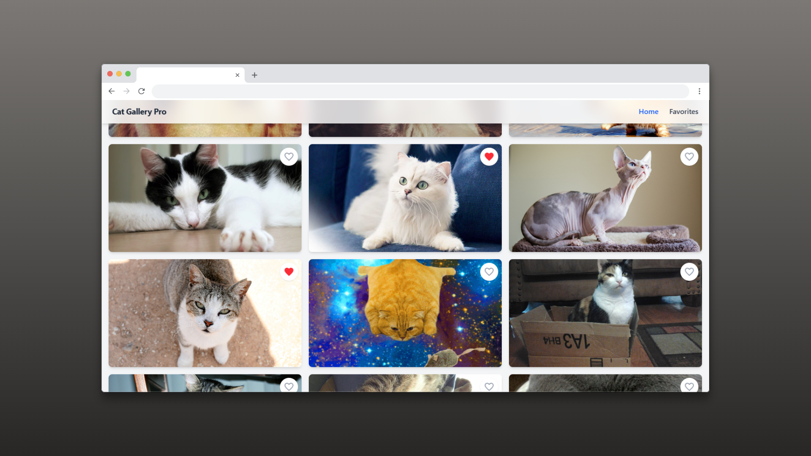
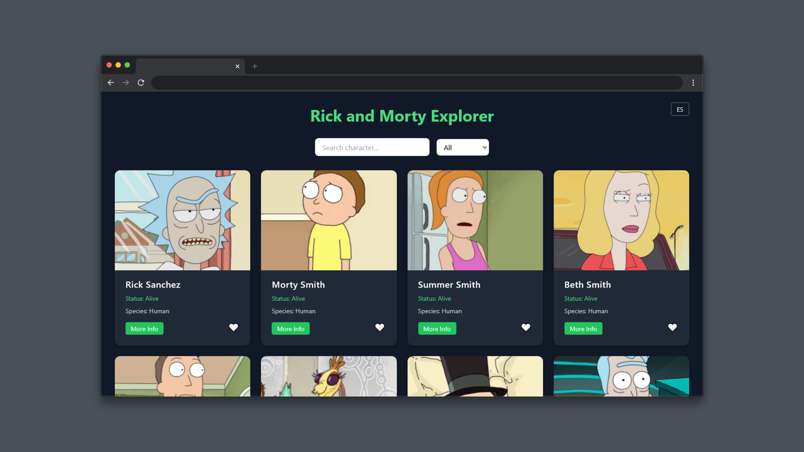

# Frontend Developer | JavaScript | React | IT Support Technician

  
  
  

  

  

  
  
  
  
  
  
  
  
  
  
  
  
  

## 🚀 Sobre mí

Soy desarrollador frontend enfocado en **JavaScript y React**, actualmente trabajando en soporte IT mientras desarrollo proyectos reales para mejorar mis habilidades como desarrollador.

Me interesa especialmente:

- Arquitectura modular en frontend
- Consumo de APIs
- Optimización de rendimiento
- Interfaces modernas y responsive

Actualmente estoy profundizando en **React** y aprendiendo **TypeScript** para construir aplicaciones más escalables y mantenibles.

## 💼 Experiencia Profesional

### Técnico de Soporte IT N1 - N2

Actualmente trabajo resolviendo incidencias técnicas y dando soporte en un entorno profesional.

Habilidades desarrolladas:
- Resolución de problemas
- Pensamiento lógico
- Comunicación técnica
- Trabajo bajo presión

## 🧩 Proyectos Destacados

<table>
<tr>

<td align="center" width="50%">

### 🐱 Cat Gallery Pro

 

🔗[ **Demo** ](https://alex3034.github.io/cat-gallery-pro) 

💻[ **Repositorio** ](https://github.com/Alex3034/cat-gallery-pro)

</td>

<td align="center" width="50%">

### 👾 Rick & Morty Explorer

 

🔗[**Demo**](https://alex3034.github.io/rick-and-morty-explorer/)

💻[**Repositorio**](https://github.com/Alex3034/rick-and-morty-explorer)

</td>

</tr>
</table>

  

## 🎯 Current Focus

Actualmente estoy trabajando en:

- Profundizar en **JavaScript moderno (ES6+)**
- Construir aplicaciones con **React**
- Aprender **TypeScript**
- Mejorar arquitectura y organización de proyectos

  

## 📫 Contacto

📧 Email: alejandrohm98a@gmail.com  
🔗 LinkedIn: [Alejandro Herrera Molina](https://www.linkedin.com/in/alejandro-herrera-molina/)  

---

⭐ Construyendo proyectos reales y mejorando cada día.

  
  
  

  

  

